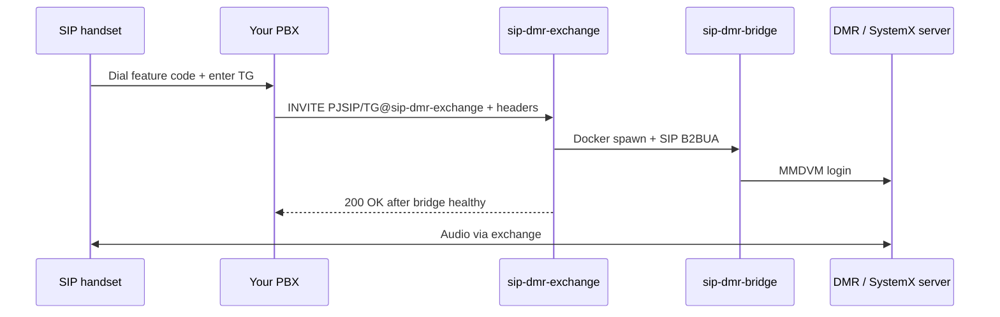

# Architecture

## End-to-end call flow



## Components

| Layer | Typical host | Responsibility |
|-------|----------------|----------------|
| **IVR + access** | PBX | Feature code, talkgroup entry, allowlist |
| **SIP trunk** | PBX | `PJSIP/${TG}@sip-dmr-exchange` |
| **Exchange** | Portal VM | Auth, provision bridge, B2BUA media |
| **Bridge** | Portal VM (Docker) | One container per call; MMDVM client |
| **Dashboard** | Portal VM (optional) | Static UI + nginx proxy to HTTP API |

## SIP headers (PBX → exchange)

| Header | Purpose |
|--------|---------|
| `X-Auth-Token` | Shared secret; exchange returns **403** if missing/wrong |
| `X-Callsign` | Caller callsign for bridge naming and RadioId lookup |
| `X-DMR-Id` | Optional explicit DMR ID |
| `X-DMR-SSID` | Optional SSID suffix for SystemX client ID |

Talkgroup is the **SIP request URI user part** (the `${TG}` in `PJSIP/${TG}@trunk`).

## Exchange internals

- Listens on `SIP_BIND_ADDR:SIP_BIND_PORT` (default `0.0.0.0:5060`)
- On INVITE: provisions `sip-dmr-bridge:latest` via local Docker socket
- Holds call until bridge **HEALTHCHECK** passes (~5–15 s cold start)
- Bridges RTP between incoming PBX leg and bridge leg (B2BUA)
- Enforces `MAX_ACTIVE_CALLS` — returns SIP **503** when at capacity

## HTTP API

Optional nginx (or similar) can expose:

### `GET /bridges`

Active bridge sessions (no auth on read in current implementation):

```json
[{
  "callsign": "M0ABC",
  "dmr_id": 1234567,
  "talkgroup": 234,
  "state": "Active",
  "state_time": "2026-08-16T12:00:00",
  "active": true
}]
```

Bridge states: `Inactive`, `Provisioning`, `Provisioned`, `Active`, `Deprovisioning`, `Deprovisioned`.

### `GET /stats`

```json
{
  "uptime": 12345.6,
  "cpu_percent": 12.3,
  "memory_percent": 75.0,
  "calls": 42,
  "users": 7
}
```

## Per-call resource cost

Measured on a small portal VM:

- ~130–150 MB RAM per bridge container (includes `md380-emu`)
- ~10–15% CPU per active bridge under TX/RX
- ~5–15 s until bridge healthy (caller may hear ringing)

Size your VM accordingly; see [Scaling](operations/scaling.md).

## Related

- [Self-hosting overview](self-host/index.md)
- [Configuration](self-host/configuration.md)
- [FreePBX integration](integration/freepbx.md)
