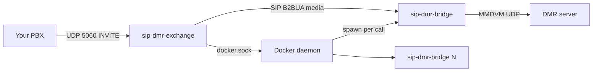
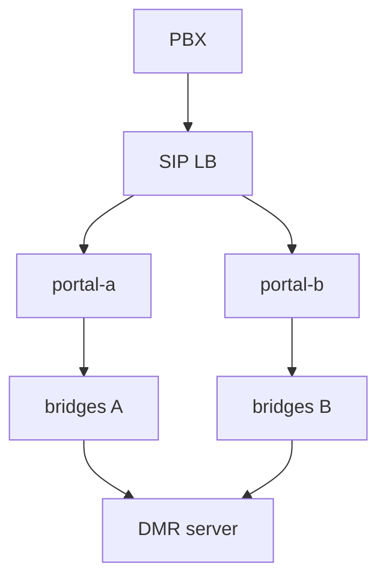

# Scaling

Phased plan to grow from a small portal (`MAX_ACTIVE_CALLS=2` on ~1 GB RAM) to **10+ concurrent calls**.

## Checklist

- [ ] Confirm DMR backend supports 10+ concurrent MMDVM logins from one public IP
- [ ] Resize portal VM to 8 GB+ RAM / 4 vCPU; set `MAX_ACTIVE_CALLS=10`
- [ ] Add startup orphan container sweep in sip-dmr-exchange (PR)
- [ ] Load test 10 simultaneous calls; monitor `/stats`, packet loss, bridge boot time
- [ ] When >10 or HA needed: second portal node, SIP LB, partitioned `DMR_LOCAL_PORT` ranges

---

## Current architecture (single host)

**Per call cost (measured):**

- ~130–150 MB RAM per bridge container
- ~10–15% CPU per active bridge under TX/RX
- ~5–15 s cold-start until Docker HEALTHCHECK passes

**Software limits today:**

- One `sip-dmr-bridge` container per call via local `docker.sock`
- `MAX_ACTIVE_CALLS` env cap; DMR local ports **62040–64040**
- Exchange B2BUA — RTP hairpins through exchange process
- In-memory state — no clustering; orphan containers possible after exchange restart

---

## Phase 1 — Single bigger host (10–15 calls)

### 1. Size the VM

| Calls | Suggested RAM | Notes |
|-------|---------------|-------|
| 10 | **8 GB** | ~1.5 GB bridges + ~1 GB exchange + OS headroom |
| 15 | **12–16 GB** | Buffer for spikes and build cache |

CPU: **4 vCPU** minimum for 10 concurrent bridges.

### 2. Exchange tuning

In `.env`:

- `MAX_ACTIVE_CALLS=10` (or 12 with headroom)
- `HOST_IP` = public VIP
- Default DMR port range is sufficient at this scale

### 3. Ops

- Thin rebuild for routine deploys (avoid full PJSIP compile on box)
- Post-deploy: compare `docker ps` with `/bridges` for orphans
- Monitor `GET /stats` — alert memory > 85%
- Periodic `docker system prune` on small disks

### 4. Optional code improvements (sip-dmr-exchange PRs)

| Change | Why |
|--------|-----|
| Startup orphan reconciliation | Kill bridge containers not tracked after exchange restart |
| `mem_limit="512m"` on bridge containers | Prevent one runaway bridge OOMing the host |
| DMR port bind-verify before assign | Avoid rare UDP collisions |

### 5. Validate

- 10 simultaneous test calls from PBX
- Watch MMDVM logs for packet loss
- Confirm DMR server accepts 10 concurrent gateway logins from one IP

---

## Phase 2 — Multi-node

### Option A — N identical portal nodes (simplest)

- Each VM: exchange + Docker + optional nginx dashboard
- PBX trunk → SIP proxy (Kamailio/OpenSIPS) with call stickiness
- Per node: `MAX_ACTIVE_CALLS=5`, partitioned `DMR_LOCAL_PORT_*`

### Option B — Dedicated bridge workers

- Exchange provisions bridges on remote hosts via new backend (SSH/API)
- More engineering; exchange dials worker bridge network

### Software milestones

1. Orphan reconciliation + metrics
2. `NODE_DMR_PORT_START` / `NODE_DMR_PORT_END` per node
3. Optional Prometheus `/metrics`
4. Later: Kubernetes or remote Docker backend

### PBX / network

- SIP LB in front of worker pool
- Firewall UDP 5060 from PBX to each worker
- Same `SIP_AUTH_TOKEN` on all workers
- `HOST_IP` per worker = that node's public IP

---

## What does not need to change for 10 calls

- **sip-dmr-bridge** image (unique local port per bridge already)
- **sip-dmr-exchange-dashboard** (static per node)
- Thin deploy workflow (not full rebuild every time)

---

## Suggested rollout

1. Confirm DMR backend capacity for target concurrent logins
2. Resize VM; set `MAX_ACTIVE_CALLS=10`; merge orphan sweep PR
3. Load test; tune memory limits
4. Add second node + SIP LB when single host is insufficient
